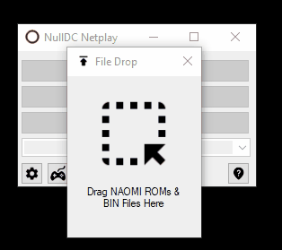
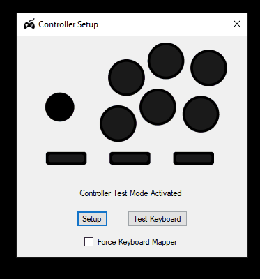
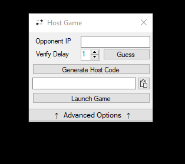
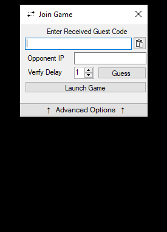

# NullDC-NAOMI Netplay Launcher Distribution 0.6.5
Configuration optimized by blueminder *(June 29, 2020)*

**Special Thanks**

- supersonicstep of FGC Arcadia Discord
- [MarioBrotha](https://github.com/MarioBrotha) of FGC Arcadia Discord (nullDCMultiLauncher, nullDCControlSetup)
- [RossenX](https://github.com/RossenX) of FGC Arcadia Discord for Netplay optimizations
- [poliva](https://github.com/poliva) & [JordiRos](https://github.com/JordiRos) of [Fightcade](https://web.fightcade.com/) for integration & testing
- BRBS of FGC Arcadia Discord for jumping on every beta as it comes out and providing feedback.
- DQRF of GGXXACR Discord
- RaptorIIRC
- Teyah
- Jakstation
- reaVer
- [skmp](https://github.com/skmp) for writing [nullDC](https://github.com/skmp/nulldc)
- [Kegetys](http://www.kegetys.fi/) for [D3D antilag](http://www.kegetys.fi/d3d-antilag-v1-01/)

## Prerequisites

Be sure the following is installed:

1. [DirectX](https://www.microsoft.com/en-us/download/details.aspx?id=35)
2. [Microsoft Visual C++ 2010 Redistributable Package (x86)](https://www.microsoft.com/en-us/download/details.aspx?id=5555)
3. [.NET Framework 4.8 Runtime](https://dotnet.microsoft.com/download/dotnet-framework/net48)

Be sure to have the following files gathered prior to testing:

1. NAOMI BIOS Files
   - Japanese BIOS: `naomi_bios.bin` (EPR-21576D)
   - USA BIOS: `naomi_boot.bin` (EPR-21577D)
2. NAOMI ROMs in the format of a ZIP file containing `.lst` & `.bin` files.

## Installing ROMs

No ROMs are provided with any NullDC Netplay Launcher release. You will have to find the NAOMI BIOS, and any NAOMI ROMs you wish to play on your own. Any community or event you participate in should have a list of approved ROMs to ensure compatibility between opponents, so feel free to ask there.

Once you have gathered the necessary files:

1. Open `nullDCNetplayLauncher.exe`
2. Open the *File Drop* menu by pressing the up button next to the controller icon on the right.
3. Locate your `naomi_bios.bin` & ROM `.zip` files in the appropriate format and drag the file into the square. Each ROM `.zip` file must be a collection of `.bin`/`.dat` files along with a corresponding `.lst` file.
   




Alternatively, you can manually place the NAOMI BIOS (`naomi_bios.bin`) in `nulldc-1-0-4-en-win\data` and place your unzipped ROMs in `nulldc-1-0-4-en-win\roms` in their own corresponding directories.

Dreamcast CDI and GDI ROMs are unsupported at this time. The directory names they reside in will be used at the ROM's display name in the launcher.

## Offline Setup

1. Open `nullDCNetplayLauncher.exe`

2. Press the Controller Icon in the bottom left corner. Be sure that only one game controller is plugged in and follow the prompts.

   **If the option is available on your arcade stick or controller, switch to PS3 mode.** This has been shown to have the best native compatibility with the qkoJAMMA netplay plugin. If you are using a Brook Universal Fighting Board, you can hold down the *Light Punch* button as you plug it into your PC to activate PS3 mode.

   

3. Select any ROM from the drop-down menu, and press the *Play Offline* button

This will launch your ROM of choice in NullDC, giving you an opportunity to test your inputs. If this works and you are assigned to Player 1, then you're all set for netplay!

## Netplay Setup

**(OPTIONAL, BUT RECOMMENDED)** [Radmin VPN](https://www.radmin-vpn.com/)

This netplay method works for any local LAN or virtual LAN setup like Radmin VPN, ZeroTier, or Hamachi. Radmin VPN is the de facto service used on FGC Arcadia. Be sure to have this installed and running before asking for matches on the Discord. You will either need to create or join a network with others also using NullDC prior to playing.

The rest of the instructions assume that Radmin is installed, but this should work the same way with any network configuration so long as you have the right host IP, ports, and your firewall isn't blocking the relevant ports.

1. Open `nullDCNetplayLauncher.exe`

2. Select any ROM from the drop-down menu

3. Start Session by pressing *Host Game* or *Join Game*

   - **Hosting a Game**

      Copy your target's IP from Radmin and paste it in the *Opponent IP* column. From there, the Launcher will automatically guess the Delay setting for your match based on your distance and ping times. If you are unable to connect, the Delay field will clear and turn red. If applicable, press the *Guess* button to try again.

      Press *Generate Host Code* and press the Clipboard icon to copy the generated code.

      Paste it to your opponent, and they should be able to generate the server details from there. Alternatively, you may expand the window and give them your Host IP, Port, and Delay. Either method works.

      Verify that you and your opponent have the same Delay set.

      Press the *Launch Game* button.
      
      
      
      
      
      
- **Joining a Game**
  
   Paste the generated Host Code and server details should automatically be filled in. If any advanced options have been set by your host, your window will expand to reveal these options.
   
   Alternatively, you may expand your window to manually enter your opponent's Host IP, Port, and Delay to continue. Either method works.
   
   Make sure you have your opponent's Radmin IP in the launcher's *Opponent IP* column. Verify that you and your opponent have the same Delay.
   
   
   
   
   
   

4. Press the *Launch Game* button.

5. Play!

If you experience any significant slowdown or strange performance, be sure to change the Delay around the determined value. It takes some trial and error, but once you have it, it's smooth sailing from there. Just be sure that you and your opponent have a matching Delay.

After you found the sweet spot, you can change the name of the preset where you would typically find "Default", and save your settings for the next time you want to play against your new Internet fight buddies.

Just in case the *Guess* button isn't reliable, these are the recommended Delay parameters based on average ping in milliseconds according to the archived [GuiltyGear XX AC Online](https://web.archive.org/web/20111028233111/https://sites.google.com/site/ggxxaconline/) site:
```
< 25ms = 1 Delay Frame needed
< 60ms = 2 Delay Frame needed
< 100ms = 3 Delay Frame needed
< 130ms = 4 Delay Frame needed
< 155ms = 5 Delay Frame needed
< 180ms = 6 Delay Frame needed
> 180ms = Don't even bother :(
```

## Command Line

The launcher now has command line options, so that you may integrate NullDC Netplay into any emulator launcher or lobby software of your choice. To see all options, you can run:

`nullDCNetplayLauncher.exe --help`

Games may be specified in a provided `games.json` file, showing ROM details like description and file location. Games listed in this file may be called by using the `--gameid` flag:

`nullDCNetplayLauncher.exe --gameid cvs2 --offline 1`

Otherwise, you may launch any path by running:

`nullDCNetplayLauncher.exe --lst-path <path to rom lst> --offline 1`

To host a game:

`nullDCNetplayLauncher.exe --gameid cvs2 --hosting 1 --ip <ip address> --port <port> --delay <delay>`

To join a game:

`nullDCNetplayLauncher.exe --gameid cvs2 --hosting 0 --ip <ip address> --port <port> --delay <delay>`

If you want the launcher to automatically guess the delay, you may use the `--guess-ip` flag:

`nullDCNetplayLauncher.exe --gameid cvs2 --hosting 0 --ip <ip address> --port <port> --guess-ip <remote ip>`

When the Launcher is called via command line, the launcher menu is kept available through an icon on the system tray. You may adjust your Keyboard Mapper options in here while your game is in session.

## Troubleshooting

> My controller is only half-detected / I am encountering input issues when I use the controller setup.

If you are having trouble with mapping your controls, try pressing the *Force Keyboard Mapper* checkbox on the controller setup menu. This will activate the launcher's internal keyboard mapper which provides expanded controller support from the default qkoJAMMA controller drivers.

If the option is available on your arcade stick, you can also try to select the "PS3" option on your controller and try again without the Keyboard Mapper enabled. PS3 controllers have been found to have the best compatibility with qkoJAMMA. If you have a Brook Universal Fighting Board, you can activate the PS3 mode by holding down Light Punch as you plug it in your computer.

------


> Is there any way to change my Keyboard controls, or joystick controls manually without the aid of the launcher?

You may edit your keyboard and joystick definitions by editing the'`.qkc` and  `.qjc`files respectively, found in the `nulldc-1-0-4-en-win\qkoJAMMA` directory. You may be able to access this folder directly by going to *Settings* > *Advanced* > *Open qkoJAMMA Folder*. You may edit these files with any text editor of your choice.

If you are setting Keyboard keys, note that numpad and arrow keys are not supported at this time. A known workaround people have used is AutoHotkey. That said, expanding keyboard controls is anticipated in a future release, since arcade cabinets popularly use IPAC and similar devices that simulate keyboard inputs.

If you are setting your joystick, be sure that the button numbers set in your corresponding `.qjc` file match your controller's definition in the *Windows Game Controllers*. You may also be able to find a shortcut to this in the *Settings* > *Advanced* menu.

------


> When I try to join or host a game, neither of us are able to connect. What should I do?

The very first step to troubleshooting network connectivity issues is to temporarily disable your firewalls to see if everything works in those conditions. You can do this in the "Windows Defender Firewall" Control Panel. If you are able to connect to each other when the firewall is off, verify your settings and make sure that you give `nullDC_Win32_Release-NoTrace.exe` permission to access private networks. If that doesn't work, enable public networks from there.

When troubleshooting network issues, keep an eye on the Command Window for any details. This will be useful information for anyone who helps you in the [FGC Arcadia Discord](https://discord.com/invite/KczAkRr).


------


> When I play Atomiswave games, every button I press just adds coins or is stuck on start.

Check to see if the Test button assignment conflicts with the Start button. It's best to make sure that none of your buttons overlap when doing the controller mapping. You can verify this by looking up the `.qjc` file that corresponds with your joystick in the `nulldc-1-0-4-en-win\qkoJAMMA` directory. This directory is accessible via the Advanced tab of the Settings.

If you are unable to fix the controls manually for a regular joystick, consider using the Keyboard Mapper. This alone has cleared up the problem for many people.

If you have any additional questions, feel free to ask in the [FGC Arcadia Discord](https://discord.com/invite/KczAkRr).
